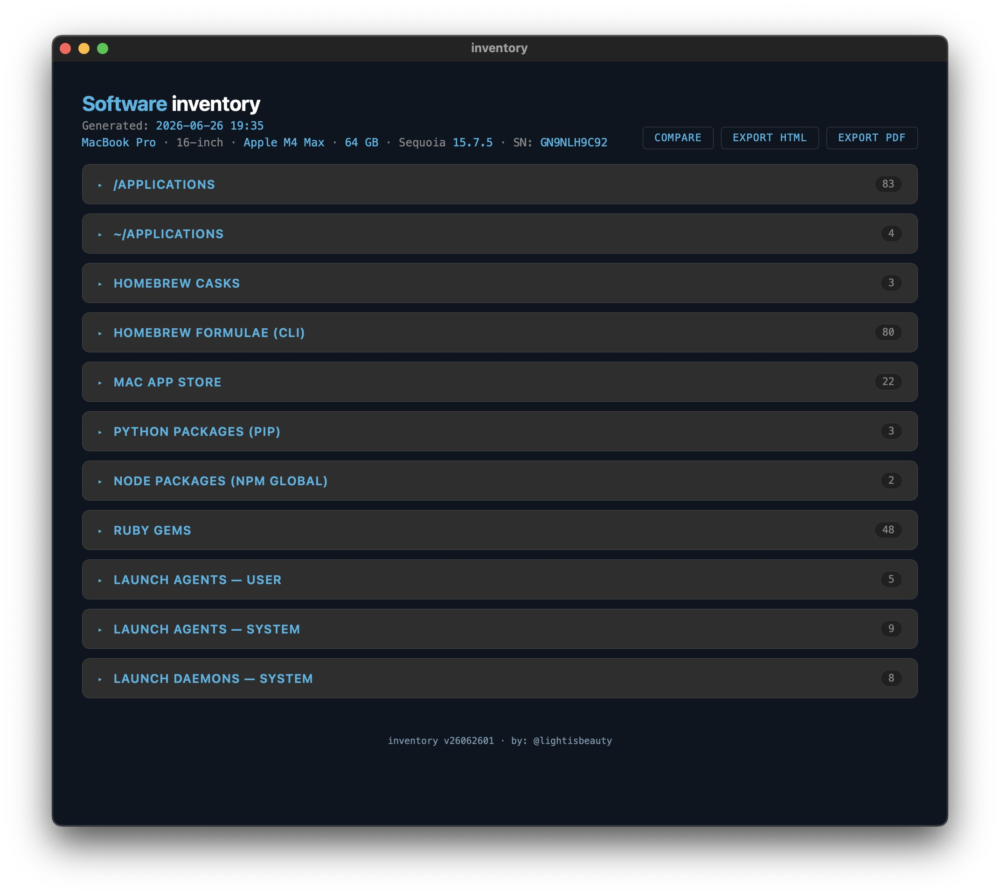
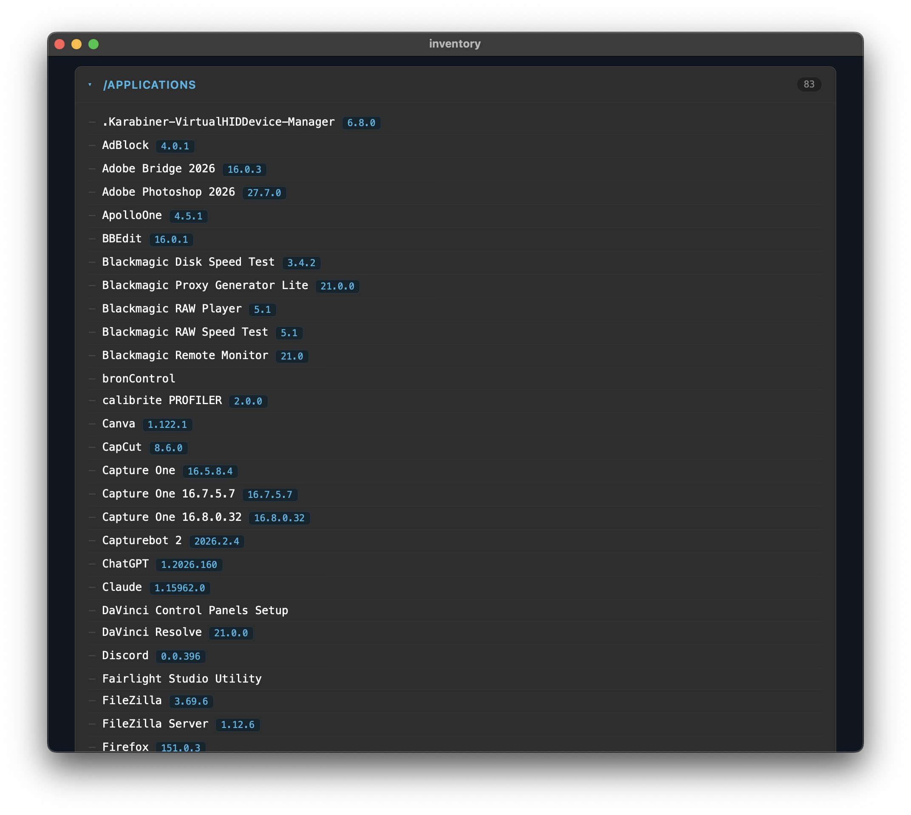
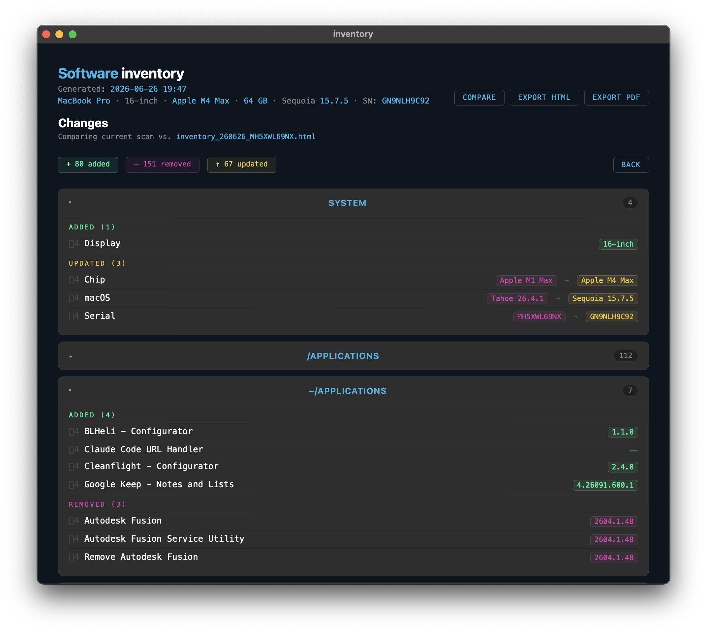

# inventory

A macOS app that scans your system for all installed software and generates an interactive report in a native window.







## What it scans

**Applications**
- `/Applications` — with version numbers (includes menu bar apps and background utilities not visible in the Dock)
- `~/Applications` — with version numbers

**Package Managers**
- Homebrew — casks and formulae (with repo links and descriptions)
- Mac App Store — app names, versions, and App Store IDs
- MacPorts
- Fink
- Nix
- Python packages (pip)
- Node.js global packages (npm)
- Ruby gems (with repo links and descriptions)
- Rust binaries (cargo)
- Conda / Mamba environments

**System & Background Software**
- Launch Agents — User (`~/Library/LaunchAgents`)
- Launch Agents — System (`/Library/LaunchAgents`)
- Launch Daemons — System (`/Library/LaunchDaemons`)

**System Info**
- Model, chip, memory, macOS version, serial number

## Privacy

Everything runs locally. No data is transmitted, collected, or shared.

## Install

1. Download `inventory.dmg` from the [latest release](https://github.com/lightisbeauty/inventory/releases/latest)
2. Open the DMG, drag `inventory.app` to Applications
3. Double-click to run

On first launch, inventory will offer to install Homebrew and `mas` if they aren't present — both are needed for the full Mac App Store inventory. All other package manager sections appear automatically if the tool is already installed on your system, and are hidden if not.

## Export

Reports can be exported as **PDF** (all sections expanded, via native save dialog) or **HTML** (self-contained file, viewable in any browser).

## Requirements

- macOS 12 or later
- Python 3 (included with Xcode Command Line Tools)
- Homebrew + `mas` — optional, installed on first run if you choose

## Build from source

```bash
git clone https://github.com/lightisbeauty/inventory.git
cd inventory
bash build_dmg.sh
```

Requires Xcode Command Line Tools for `swiftc` and Homebrew's `create-dmg`.

## License

GPL-3.0 — see [LICENSE](LICENSE)

by: [@lightisbeauty](https://github.com/lightisbeauty)
